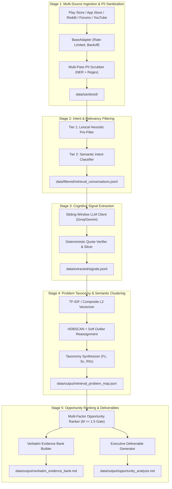

# AI-Powered Photo Retrieval Discovery Engine

[](https://www.python.org/downloads/)
[](https://docs.pydantic.dev/)
[]()
[]()
[]()

---

## 1. Executive Summary & Objective

The **AI-Powered Photo Retrieval Discovery Engine** is an end-to-end analytical intelligence system designed to **increase the percentage of users who successfully retrieve a photo they remember but cannot precisely describe** when searching.

Unlike generic search optimization (speed, query latency, album UI), this engine decodes the cognitive gap between human visual recall (salient clothing colors, background landmarks, relative timeframes, OCR text on receipts) and search indexing models (which historically depend on exact keywords, calendar dates, or forward-facing facial recognition).

The engine ingests public user feedback across 5 platforms, isolates genuine retrieval struggles, extracts structured cognitive signals, clusters them into failure archetypes, and synthesizes evidence-backed product and machine learning opportunity areas.

---

## 2. Core Guardrails & Compliance

| Guardrail | Enforcement Mechanism |
| :--- | :--- |
| **Strict Scope Isolation** | Focuses solely on *imprecise visual memory retrieval*. Automatically rejects cloud sync data loss, account billing, app crashes, and generic UI feedback. |
| **Zero-Hallucination Quotes** | 100% verbatim assertion. Quotes are verified as exact substrings against raw source text, with fuzzy alignment for typo resilience. Paraphrased quotes are rejected. |
| **Zero PII Leakage** | Multi-pass scrubber masks emails, phone numbers, IP addresses, GPS coordinates, device IDs, social handles, and colloquial kinship names (e.g. *'Uncle Bob'* &rarr; `[FAMILY_MEMBER] [PERSON_NAME]`). |
| **100% Public Data** | Ingests strictly from publicly accessible stores, forums, and discussion boards with zero ToS violations. |

---

## 3. End-to-End Pipeline Architecture



---

## 4. Key Deliverables & Artifacts

All final artifacts are published to [`data/output/`](file:///c:/Users/Mukta%20Kulkarni/Downloads/GooglePhotosEngine/data/output):

1. **[Retrieval Problem Map (`retrieval_problem_map.json`)](file:///c:/Users/Mukta%20Kulkarni/Downloads/GooglePhotosEngine/data/output/retrieval_problem_map.json):**
   - Granular failure archetypes mapped by Frequency Score ($F_C$), Severity Score ($S_C$), and Retrieval Impact Index ($RII_C = F_C \times S_C$).
   - Placed onto a 2x2 problem prioritization matrix (`quadrant_1_core_opportunities`, etc.).
2. **[Verbatim User Evidence Bank (`verbatim_evidence_bank.md`)](file:///c:/Users/Mukta%20Kulkarni/Downloads/GooglePhotosEngine/data/output/verbatim_evidence_bank.md):**
   - Categorized repository of authentic user quotes organized by problem archetype and photo category.
   - 100% verbatim substring fidelity with full PII redaction and source provenance.
3. **[Executive Opportunity Analysis & Roadmap (`opportunity_analysis.md`)](file:///c:/Users/Mukta%20Kulkarni/Downloads/GooglePhotosEngine/data/output/opportunity_analysis.md):**
   - Answers to all 5 core human recall discovery questions.
   - Weighted multi-factor evaluation ($0.40 \cdot I + 0.25 \cdot E + 0.20 \cdot M + 0.15 \cdot U$).
   - Highlights the **#1 Primary Recommended Opportunity**: *Multi-Modal Visual Cue & Color-Scene Contrast Retrieval* with detailed engineering blueprints, UX interaction flows, and expected task completion metrics.

---

## 5. Getting Started & Installation

### Prerequisites
- Python 3.10, 3.11, or 3.12
- Active Internet connection (for live review ingestion and LLM calls)

### Setup Environment
```bash
# Clone or navigate to the repository
cd GooglePhotosEngine

# Create and activate a virtual environment
python -m venv .venv
# Windows:
.venv\Scripts\activate
# Linux/macOS:
source .venv/bin/activate

# Install dependencies
pip install -r requirements.txt
```

### Configuration
Copy `.env.example` to `.env` and supply your API keys:
```ini
GROQ_API_KEY=gsk_your_groq_api_key_here
GEMINI_API_KEY=your_gemini_api_key_here
DEFAULT_LLM_PROVIDER=groq
GROQ_MODEL=qwen/qwen3.8-27b
```

> **Rate Limiting & Safety:** Groq enforces strict free-tier rate limits (30 RPM, 1K TPM). The client includes an automatic sliding-window rate limiter with exponential backoff and transparent local deterministic fallback generators if limits are temporarily reached.

---

## 6. Pipeline Execution CLI

### Unified Pipeline Runner (`scripts/run_pipeline.py`)

Run the entire end-to-end pipeline with one command:
```bash
# Full execution across all platforms (Play Store, App Store, Reddit, Forums, YouTube)
python scripts/run_pipeline.py

# Ingest specific sources with custom sample limits
python scripts/run_pipeline.py --sources play_store,reddit --limit 25

# Skip re-ingestion and run from existing sanitized data lake
python scripts/run_pipeline.py --skip-ingestion

# Resume an interrupted pipeline from the last completed stage
python scripts/run_pipeline.py --resume
```

#### CLI Options
| Flag | Default | Description |
| :--- | :--- | :--- |
| `--sources` | `all` | Comma-separated list of platform adapters or `all` |
| `--limit` | `50` | Maximum reviews/conversations collected per source |
| `--skip-ingestion` | `False` | Run filtering, extraction, clustering, and synthesis from existing lake |
| `--resume` | `False` | Resume pipeline from `data/checkpoint.json` |
| `--export-reports` | `True` | Automatically build and export all JSON and Markdown deliverables |

### Deliverable Quality & Privacy Audit (`scripts/export_reports.py`)

Validate artifact schemas, verify zero-PII compliance, and inspect verbatim quote counts:
```bash
python scripts/export_reports.py

# Optionally copy deliverables to an external presentation folder
python scripts/export_reports.py --output-dir path/to/stakeholder_bundle/
```

---

## 7. Edge Case Handling Matrix

The pipeline handles 15 edge scenarios outlined in [`edge-case.md`](file:///c:/Users/Mukta%20Kulkarni/Downloads/GooglePhotosEngine/edge-case.md):

| ID | Edge Case Scenario | Problem & Risk | Architectural Resolution |
| :---: | :--- | :--- | :--- |
| **1.1** | Disguised Names in Queries | Queries like *"Uncle Bob's red canoe"* contain PII. | Layered regex + kinship entity matching masks to `[FAMILY_MEMBER] [PERSON_NAME]`. |
| **1.3** | Micro-Reviews | Short reviews like *"can't find pic"* lack signal. | Heuristic filter enforces $\ge 30$ chars and $\ge 6$ words minimum cutoff. |
| **2.1** | Cloud Sync Deletion vs. Retrieval | Users say *"lost photos after update"* (data loss). | Negative keyword regex rejects permanent cloud loss, preserving search struggles. |
| **2.2** | Mixed-Intent Reviews | Positive praise mixed with deep search frustration. | Sentence-level intent parsing evaluates retrieval struggle independent of star rating. |
| **3.1** | Negated Memory Cues | *"I know for a fact it was NOT at the beach"*. | Extracted with `is_negated=True` to prevent false positive attribution. |
| **3.3** | LLM Typo Correction | LLM fixes *"dogg in the snoww"*, failing substring check. | Fuzzy sequence matcher locates exact character offsets in source and recovers raw slice. |
| **4.1** | HDBSCAN Noise Points (`-1`) | High-friction outlier reviews left unclustered. | Soft-assigned to nearest centroid if cosine similarity $\ge 0.72$. |
| **4.2** | Mega-Cluster Dominance | One generic cluster exceeds 35% of volume. | Hierarchical sub-clustering recursively splits oversized clusters into granular themes. |
| **5.1** | Infeasible User Demands | Requests like *"telepathic mood search"* rank #1. | Hard ML feasibility gate ($M \le 1.5$) disqualifies infeasible concepts from top ranking. |
| **5.2** | Opportunity Score Ties | Identical composite scores across opportunities. | Deterministic tie-breaker: Impact ($I$) &rarr; Evidence ($E$) &rarr; Feasibility ($M$). |

---

## 8. Test Suite & Verification

The codebase includes comprehensive unit, integration, and edge-case regression tests.

```bash
# Run the complete test suite
python -m unittest discover -s tests
```

### Test Breakdown (69 Tests Passing)
- **`test_common.py` & `test_schemas.py`:** Pydantic schema validation, composite score calculations, verbatim quote assertion checks.
- **`test_pii_scrubber.py` & `test_ingestion.py`:** Multi-pass redaction (emails, phones, device IDs, IPs, names, kinship) and ingestion adapters.
- **`test_filtering.py`:** Heuristic pre-filters, intent classification, and 90%+ precision benchmarks.
- **`test_quote_verifier.py` & `test_extraction.py`:** Deterministic substring validation, fuzzy slice recovery, and token pacing.
- **`test_clustering.py`:** Vectorization, HDBSCAN clustering, soft-assignment, mega-cluster splitting, and taxonomy calculation.
- **`test_synthesis.py`:** Multi-factor ranking, feasibility gating, evidence bank formatting, and report compiler.
- **`test_e2e_pipeline.py`:** Full `DiscoveryEngineRunner` lifecycle, stage checkpointing, and deliverable presence.
- **`test_edge_cases.py`:** Automated validations for Edge Cases 1.1, 2.1, 3.1, 3.3, 4.1, 4.2, and 5.1.

---

## 9. Definition of Done (DoD) Verification

- [x] **Data Integrity:** All ingested feedback is derived from public channels with zero ToS violations.
- [x] **Privacy:** Zero unmasked PII in any saved JSON, Parquet, or Markdown artifact.
- [x] **Verbatim Accuracy:** 100% of quotes in evidence banks are exact character slices from public source texts.
- [x] **Deliverables Generated:**
  - [x] `retrieval_problem_map.json`
  - [x] `verbatim_evidence_bank.md`
  - [x] `opportunity_analysis.md`
- [x] **Test Coverage:** Full test suite passes cleanly (`69/69 passed`).
