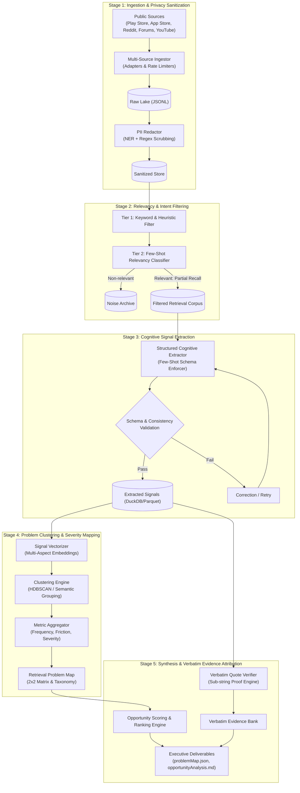
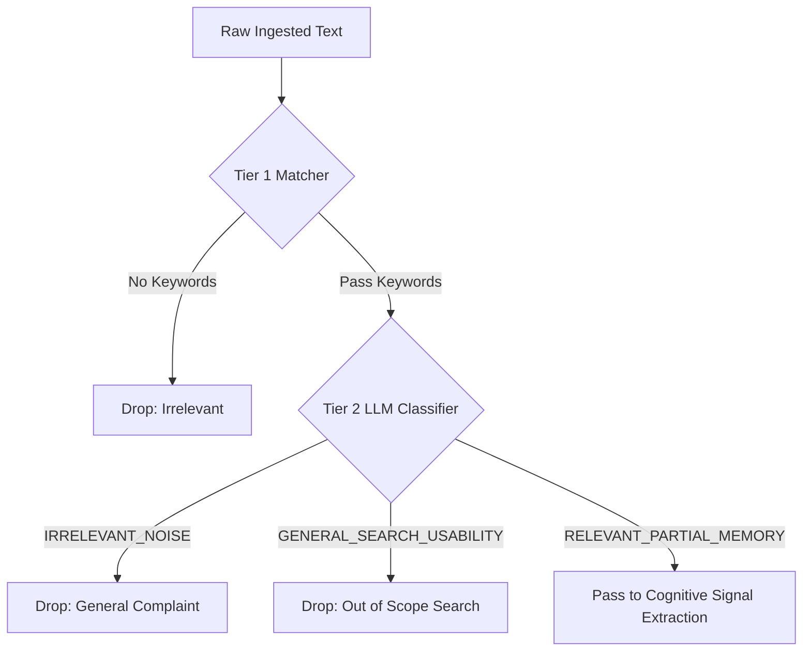
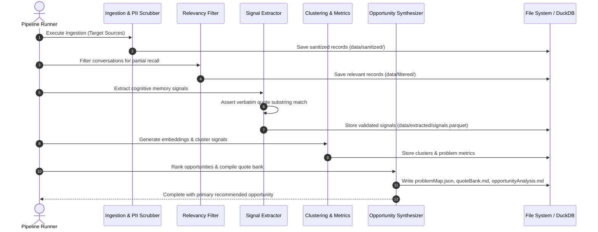

# Technical Architecture Specification: AI-Powered Photo Retrieval Discovery Engine

---

## 1. System Overview & Core Purpose

The **Photo Retrieval Discovery Engine** is an end-to-end analytical pipeline designed to ingest unstructured public user discussions at scale, identify points of friction where users attempt to retrieve photos from partial or vague memories, extract structured cognitive recall signals, cluster them into distinct failure modes, and generate evidence-backed opportunity areas.

### 1.1 Architectural Goals
- **Strict Scope Enforcement:** Filter noise to focus exclusively on visual memory retrieval failures rather than general application complaints (e.g., storage quotas, backup syncing, UI redesigns).
- **Zero-Hallucination Evidence Traceability:** Guarantee that all quotes and user evidence surfaced are verbatim, unaltered, and strictly validated against raw input text.
- **Privacy-by-Design:** Anonymize and strip all Personally Identifiable Information (PII) before LLM ingestion and reporting.
- **Deterministic Structured Output:** Enforce strict Pydantic schemas across LLM extraction stages to enable quantitative clustering and ranking.

---

## 2. High-Level Architecture

The engine is structured as a five-stage modular pipeline supported by a centralized analytical storage layer and quote validation engine:



---

## 3. Pipeline Stages & Detailed Module Specifications

### Module 1: Multi-Source Ingestion & Privacy Sanitization (`src/ingestion/`)

#### 1.1 Ingestion Adapters
- **Role:** Collect unstructured text while honoring public rate limits and platform robots.txt/APIs.
- **Connectors:**
  - `PlayStoreAdapter`: Google Play Store customer reviews.
  - `AppStoreAdapter`: Apple App Store customer reviews.
  - `RedditAdapter`: Public discussions from r/googlephotos, r/Android, r/techsupport.
  - `CommunityForumAdapter`: Google Support Community threads.
  - `YouTubeCommentAdapter`: Comments on photo management and feature walkthrough videos.
- **Raw Schema:** Each ingested record captures `raw_id`, `source`, `timestamp`, `raw_text`, and `source_url`.

#### 1.2 PII Redaction Pipeline
- **Role:** Strip all personal markers prior to any analytical or LLM handling.
- **Engine:** Two-pass redaction using **Microsoft Presidio / spaCy NER** coupled with customized regular expressions.
- **Masking Rules:**
  - User handles, names, emails, URLs with tracking tokens, phone numbers, IP addresses, GPS coordinates, and device unique identifiers.
  - Replacement tokens: `[USER]`, `[EMAIL]`, `[LOCATION]`, `[DEVICE]`.

---

### Module 2: Relevancy & Intent Filtering (`src/filtering/`)

Because over 90% of public feedback concerns sync bugs, storage limits, pricing, or basic app crashes, a two-tier filter discards non-retrieval discussions.

#### 2.1 Tier 1: Lexical & Heuristic Filter
- High-speed keyword and n-gram matcher checking for co-occurrence of:
  - *Retrieval verbs:* "find", "search", "looking for", "remember", "locate", "lost track of", "scroll".
  - *Visual/media targets:* "photo", "picture", "screenshot", "video", "receipt", "pic".
  - *Memory friction markers:* "can't remember", "forgot", "vague", "somewhere in", "years ago", "back in".
- Hard negatives dropped immediately: "billing", "google one subscription", "failed to backup", "battery drain", "update ruined UI".

#### 2.2 Tier 2: LLM Intent Classifier
- Classifies candidate texts into one of three buckets:
  1. `RELEVANT_PARTIAL_MEMORY`: The user specifically details trying to locate a photo where memory details were incomplete or search failed to parse their intent.
  2. `GENERAL_SEARCH_USABILITY`: The user searched for an exact keyword or date and experienced a UI bug or slow performance. (Excluded)
  3. `IRRELEVANT_NOISE`: Unrelated feedback. (Excluded)



---

### Module 3: Cognitive Signal Extraction (`src/extraction/`)

Extracts the cognitive mental model of the user when their memory failed.

#### 3.1 Cognitive Extraction Schema (Pydantic Contract)
Every conversation is mapped into a structured entity:

```python
class MemoryCueType(str, Enum):
    TEMPORAL = "temporal"           # e.g., "around 3 years ago", "in college"
    SPATIAL = "spatial"             # e.g., "in a coffee shop", "on vacation in Italy"
    VISUAL_COLOR = "visual_color"   # e.g., "wearing a bright yellow shirt"
    OBJECT_SCENE = "object_scene"   # e.g., "dog next to a red fence"
    ACTIVITY_EVENT = "activity"     # e.g., "hiking", "birthday dinner"
    DOCUMENT_OCR = "document_ocr"   # e.g., "receipt with a blue logo", "wifi password"
    EMOTIONAL = "emotional"         # e.g., "funny meme", "beautiful sunset"

class SearchFailureMode(str, Enum):
    ZERO_RESULTS = "zero_results"
    SEMANTIC_DRIFT = "semantic_drift"           # Results returned, but wrong semantic meaning
    CHRONOLOGICAL_OVERLOAD = "chronological_overload" # 10,000 photos to manually scroll
    OCR_FAILURE = "ocr_failure"                 # Text in image was not matched
    FACIAL_RECOGNITION_GAP = "facial_gap"       # Face hidden, turned away, or unclustered
    SYNTAX_FRUSTRATION = "syntax_frustration"   # User did not know what keywords to type

class MemorySignalRecord(BaseModel):
    record_id: str
    source_text: str
    photo_type: str                            # e.g., "candid portrait", "screenshot", "receipt"
    remembered_cues: list[dict[str, str]]      # [{"cue_type": "visual_color", "detail": "yellow sweater"}]
    forgotten_details: list[str]               # ["exact date", "city name", "sender"]
    attempted_queries: list[str]               # ["yellow sweater beach 2021", "yellow jacket"]
    failure_mode: SearchFailureMode
    user_frustration_score: int                # 1 (mild annoyance) to 5 (complete task abandonment)
    verbatim_quote: str                        # Exact sub-string extracted directly from source_text
```

#### 3.2 Verbatim Quote Provenance Rule
- The field `verbatim_quote` is strictly verified using exact substring matching (`assert verbatim_quote in source_text`).
- If an LLM paraphrases or edits the quote, a deterministic assertion rejects the extraction and forces re-extraction using the original text slice.

---

### Module 4: Problem Clustering & Severity Mapping (`src/clustering/`)

#### 4.1 Embedding Representation
- Signals are synthesized into a semantic representation combining:
  `[Photo Type] + [Failure Mode] + [Remembered Cues vs Forgotten Cues]`.
- Text embeddings generated via high-density embedding models (e.g., `text-embedding-3-large` or `all-mpnet-base-v2`).

#### 4.2 Clustering Algorithm
- **Clustering:** **HDBSCAN** (Hierarchical Density-Based Spatial Clustering of Applications with Noise) combined with **UMAP** dimensionality reduction.
- **Handling Outliers:** Unclustered data points are assigned using soft cosine similarity to the nearest cluster centroid or placed in a discovery sandbox.
- **Cluster Synthesis:** An LLM inspects the top exemplar instances of each cluster to assign a standardized problem title, detailed description, and root cognitive cause.

#### 4.3 Severity & Prioritization Metrics
For each problem cluster $C$, the engine calculates:
1. **Frequency Score ($F_C$):** Normalized percentage of total relevant retrieval conversations.
   $$F_C = \frac{|C|}{N_{\text{total}}}$$
2. **Severity / Frustration Score ($S_C$):** Average user frustration level (scaled 1.0 to 5.0) derived from linguistic friction cues, sentiment intensity, and abandonment mentions.
   $$S_C = \frac{1}{|C|} \sum_{i \in C} \text{frustration\_score}_i$$
3. **Retrieval Impact Index ($RII_C$):**
   $$RII_C = F_C \times S_C$$

---

### Module 5: Opportunity Ranking & Synthesis (`src/synthesis/`)

The opportunity engine converts problem clusters into product opportunities, evaluates feasibility, and selects the recommended focus area.

```mermaid
quadrantChart
    title Retrieval Problem Map: Frequency vs Severity
    x-axis Low Severity --> High Severity
    y-axis Low Frequency --> High Frequency
    quadrant-1 High Impact (Priority 1: Core Opportunities)
    quadrant-2 Broad Friction (Priority 2: Quality of Life)
    quadrant-3 Low Priority (Niche Edge Cases)
    quadrant-4 Critical Blockers (Priority 3: High Pain, Lower Volume)
    "Vague Temporal & Color Recall": [0.82, 0.78]
    "Screenshot & OCR Text Loss": [0.65, 0.85]
    "Partial Event / Setting Recall": [0.75, 0.60]
    "Unindexed Background Objects": [0.55, 0.45]
    "Specific Angle / Pose Search": [0.88, 0.25]
    "Misremembered Date Filter": [0.40, 0.35]
```

#### 5.1 Opportunity Evaluation Framework
Each candidate opportunity area is scored across four dimensions:
- **Impact on Task Completion ($I$):** Reduction in search abandonment.
- **Evidence Confidence ($E$):** Volume of distinct verbatim user quotes supporting the pattern.
- **Engineering / ML Feasibility ($M$):** Feasibility of solving via multi-modal embeddings, cross-attention, or conversational refinement.
- **UX Addressability ($U$):** How easily users can express the memory cue without complex query syntax.

$$\text{Opportunity Score} = 0.40 \cdot I + 0.25 \cdot E + 0.20 \cdot M + 0.15 \cdot U$$

---

## 4. Directory & File Organization

The project will follow a clean, modular structure:

```
GooglePhotosEngine/
├── problemStatement.md              # Project mandate & objectives
├── architecture.md                  # This document: system architecture & specifications
├── pyproject.toml                   # Project dependencies and packaging
├── data/
│   ├── raw/                         # Raw ingested public records (JSONL, immutable)
│   ├── sanitized/                   # PII-scrubbed records
│   ├── filtered/                    # Relevant retrieval-only records
│   ├── extracted/                   # Structured cognitive signal records (Parquet)
│   └── output/                      # Generated problem map, evidence bank, reports
├── src/
│   ├── __init__.py
│   ├── common/
│   │   ├── config.py                # Environment configs, model params, rate limits
│   │   ├── logger.py                # Structured logging
│   │   └── schemas.py               # Pydantic data schemas
│   ├── ingestion/
│   │   ├── base_adapter.py          # Abstract base ingestion interface
│   │   ├── play_store.py            # Play Store scraper/API client
│   │   ├── app_store.py             # App Store adapter
│   │   ├── reddit_adapter.py        # Reddit forum client
│   │   └── pii_scrubber.py          # Presidio/regex PII redaction engine
│   ├── filtering/
│   │   ├── heuristics.py            # Fast keyword & negative pattern filter
│   │   └── classifier.py            # Two-tier LLM intent classifier
│   ├── extraction/
│   │   ├── prompt_templates.py      # Few-shot prompts for memory signal extraction
│   │   ├── extractor.py             # Structured output extraction runner
│   │   └── validator.py             # Substring quote validator & schema checker
│   ├── clustering/
│   │   ├── vectorizer.py            # Sentence & multi-signal embedding generator
│   │   ├── clusterer.py             # UMAP + HDBSCAN clustering pipeline
│   │   └── taxonomy.py              # Cluster labeling & metrics aggregator
│   └── synthesis/
│       ├── ranking.py               # Opportunity scoring & prioritization
│       ├── quote_bank.py            # Verbatim quote indexer & organizer
│       └── report_generator.py      # Markdown & JSON deliverable compiler
├── tests/
│   ├── test_pii_scrubber.py         # Verification that no PII escapes
│   ├── test_quote_verifier.py       # Exact match assertion testing
│   ├── test_schemas.py              # Pydantic schema validation tests
│   └── test_filtering.py            # Classifier accuracy test cases
└── scripts/
    ├── run_pipeline.py              # CLI entry point to execute the complete pipeline
    └── export_reports.py            # Export deliverables
```

---

## 5. Data Flow & State Lifecycle



---

## 6. Verification, Validation & Guardrail Framework

### 6.1 Substring Verbatim Assertion
To guarantee that no user quotes are generated or paraphrased by LLMs:
```python
def verify_verbatim_quote(raw_text: str, quote: str) -> bool:
    # Normalize unicode whitespace without altering word characters
    clean_raw = " ".join(raw_text.split())
    clean_quote = " ".join(quote.split())
    return clean_quote in clean_raw
```
If verification fails, the pipeline automatically strips the quote or falls back to an exact character-index span extraction.

### 6.2 PII Redaction Verification Test Suite
Automated regression tests run against synthetic ground-truth sets containing:
- Email addresses (`test@example.com`)
- Phone numbers (`+1-555-0199`)
- Real names and usernames (`@johndoe`, `Johnathan Smith`)
- Exact addresses and geo-coordinates
*Gate Condition:* Any test run detecting unmasked PII terminates the pipeline build immediately.

---

## 7. Recommended Technology Stack

| Layer | Component / Technology | Justification |
| :--- | :--- | :--- |
| **Language** | Python 3.11+ | Type hints, rich ML ecosystem, fast execution |
| **Schema & Validation**| Pydantic v2 | High performance data validation and JSON schema enforcement |
| **Storage & Analytics** | DuckDB + Parquet | Serverless, lightning-fast analytical queries on tabular signals |
| **PII Scrubbing** | Microsoft Presidio + regex | Production-grade redaction of names, emails, and identifiers |
| **Embeddings** | `sentence-transformers` (or modern API embeddings) | Dense semantic clustering of cognitive query patterns |
| **Clustering** | UMAP + HDBSCAN | Non-linear dimensionality reduction and density-based clustering without pre-fixing $k$ |
| **LLM Orchestration** | LiteLLM / Instructor | Strict structured output handling with schema enforcement and retries |
| **Visualization & Output** | Rich / Markdown / Mermaid | Standardized, accessible deliverable generation |

---

## 8. Summary of Outputs & Deliverables

At the conclusion of the execution pipeline, the following artifacts are generated:
1. `data/output/retrieval_problem_map.json`: Machine-readable breakdown of clusters, metrics ($F_C, S_C, RII_C$), and cognitive gap descriptors.
2. `data/output/verbatim_evidence_bank.md`: Categorized collection of real, anonymized quotes grouped by failure mode.
3. `data/output/opportunity_analysis.md`: Detailed report comparing problem areas, trade-offs, technical feasibility, and the final prioritized product recommendation.
