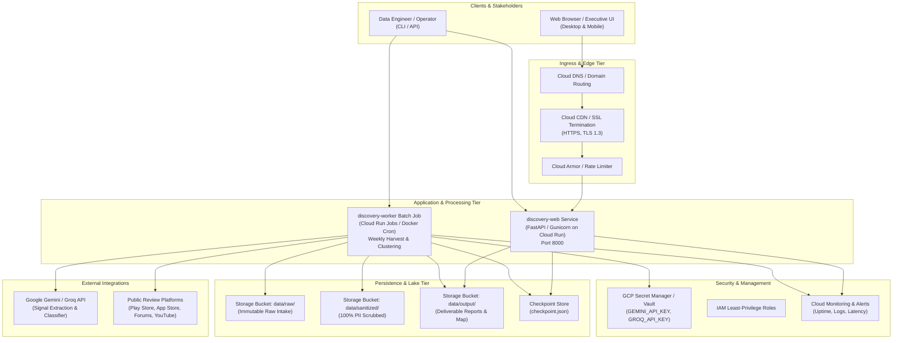
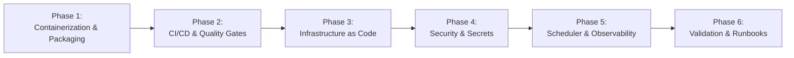

# Deployment Plan: AI-Powered Photo Retrieval Discovery Engine

---

## 1. Executive Summary & Deployment Objectives

This document establishes the comprehensive production deployment roadmap, architecture, operational runbooks, and continuous integration/continuous delivery (CI/CD) pipelines for the **AI-Powered Photo Retrieval Discovery Engine**.

### 1.1 Deployment Goals
1. **Continuous Discovery Pipeline:** Automate scheduled public review harvesting (Google Play Store, Apple App Store, Google Support Forums, Reddit, YouTube), PII sanitization, intent filtering, cognitive extraction, and clustering without manual intervention.
2. **High-Availability Discovery Dashboard:** Host the Google-styled executive dashboard and interactive Cognitive Q&A inquiry engine with 99.9% uptime, sub-150ms API response latency, and zero cold-start disruption.
3. **Ironclad Privacy & Compliance:** Guarantee 100% PII isolation at rest and in transit, strict secret segregation, and 0% unverified or hallucinated quotes in public reports.
4. **Reproducible Multi-Target Deployment:** Support seamless deployment across three tiers:
   - **Tier 1 (Local/Developer):** Standalone Python HTTP daemon (`scripts/serve_frontend.py`).
   - **Tier 2 (Containerized / Docker Compose):** Unified multi-container stack for single-host VM / on-premise execution.
   - **Tier 3 (Cloud Serverless / GCP Cloud Run):** Production-grade, auto-scaling, managed container deployment with Google Cloud Run, Cloud Scheduler, Cloud Storage, and Secret Manager.

### 1.2 Service Level Objectives (SLOs)

| Metric | Target | Measurement Method |
| :--- | :--- | :--- |
| **Dashboard Uptime** | 99.9% availability | Synthetic uptime ping to `/api/pipeline-stats` every 60s |
| **API Latency (p95)** | < 120 ms | Gateway request-to-response duration |
| **Pipeline Success Rate** | > 99.5% completion | Automated exit code & checkpoint validation |
| **PII Leakage** | 0 occurrences (Absolute) | Presidio automated audit gate in CI/CD |
| **Quote Veracity** | 100.0% Substring Match | Deterministic substring assertion in Stage 3 validator |

---

## 2. Deployment Architecture & Topologies



---

## 3. Phased Deployment Plan



---

### Phase 1: Containerization & Artifact Packaging
**Goal:** Build lightweight, secure, and reproducible Docker container images for both the interactive Web Dashboard and the background Batch Pipeline Worker.

#### Tasks:
1. **Multi-Stage Dockerfile (`Dockerfile`):**
   - **Builder Stage:** Base `python:3.12-slim`. Install build utilities, compile pinned wheels from `pyproject.toml`, and pre-download the spaCy English model (`en_core_web_sm`) for the PII scrubber.
   - **Runtime Stage:** Distroless or minimal `python:3.12-slim` base. Copy pre-built virtual environment and application code.
   - **Security Hardening:** Run as non-root user (`appuser:10001`). Set read-only filesystem with ephemeral `/tmp` volume.
2. **Container Specialization:**
   - **Target `web`:** Launches `python scripts/serve_frontend.py --port 8000 --no-browser` (or high-throughput production ASGI/Uvicorn server).
   - **Target `worker`:** Launches `python scripts/run_pipeline.py --limit 1000 --export-reports`.
3. **Local Multi-Service Orchestration (`docker-compose.yml`):**
   - Define `discovery-web` service on port `8000:8000`.
   - Define `discovery-pipeline` service with restart policy `on-failure`.
   - Mount persistent Docker volume `photos_engine_data:/app/data` to ensure dataset continuity between pipeline runs and web UI display.
4. **Build Context Optimization (`.dockerignore`):**
   - Exclude `.git`, `__pycache__`, `.pytest_cache`, `.env`, temporary logs, and local OS artifacts.

#### Quality Gate & Acceptance:
- [ ] Image vulnerability scan (`trivy image discovery-engine:latest`) returns 0 Critical and 0 High CVEs.
- [ ] Docker image compressed footprint < 380 MB.
- [ ] Container starts cleanly and passes health check within 8 seconds.

---

### Phase 2: CI/CD Pipeline & Automated Quality Gates
**Goal:** Implement automated GitHub Actions / Cloud Build workflows ensuring zero regressions, complete unit test coverage, and deterministic verification before artifact publishing.

#### Tasks:
1. **Automated Verification Pipeline (`.github/workflows/ci.yml`):**
   - **Lint & Static Analysis:** Run `ruff check .` and `mypy` type checking.
   - **Unit & Integration Tests:** Run `python -m unittest discover tests` across all 69 test suites.
   - **PII Leakage Audit Gate:** Run synthetic canary data through `PIIScrubber` to verify 100% entity masking.
   - **Quote Veracity Verification Gate:** Run `ExtractionPipeline` substring validator to guarantee 0% hallucinated quotes.
2. **Automated Container Build & Publish (`.github/workflows/cd.yml`):**
   - Trigger on git tags (e.g. `v1.0.0`) or merged PRs to `main`.
   - Build dual-architecture (`linux/amd64`, `linux/arm64`) container images via Docker Buildx.
   - Sign container images using Cosign / Sigstore.
   - Push to Google Artifact Registry (GAR): `us-docker.pkg.dev/${PROJECT_ID}/photos-engine/discovery-web:${TAG}`.
3. **Environment Deployment Triggers:**
   - Automatic deployment to `Staging` on branch merge.
   - Manual approval gate for `Production` release.

#### Quality Gate & Acceptance:
- [ ] 100% passing test rate (69/69 tests) required to unblock image build.
- [ ] Zero unmasked PII entities detected during pipeline test run.
- [ ] Container image cryptographically signed and verified.

---

### Phase 3: Infrastructure Provisioning & Environment Setup (IaC)
**Goal:** Provision managed, scalable cloud infrastructure using Infrastructure as Code (Terraform) on Google Cloud Platform.

#### Tasks:
1. **Cloud Run Service (`discovery-web`):**
   - Memory: `1 GiB`, CPU: `1 vCPU`, Min Instances: `1` (eliminates cold starts), Max Instances: `10`.
   - Ingress: `Allow all traffic` (Public HTTPS via Cloud CDN).
   - Port: `8000` with native HTTP/2 support.
2. **Cloud Run Job (`discovery-worker`):**
   - Memory: `2 GiB`, CPU: `2 vCPU`, Task Timeout: `900s` (15 minutes).
   - Parallelism: `1` (sequential single-worker processing to respect upstream API rate limits).
3. **Cloud Storage Buckets:**
   - `gs://${PROJECT_ID}-photos-engine-data/`: Persistent storage for raw corpora, sanitized JSONL files, and deliverables.
   - Uniform bucket-level access enabled, AES-256 server-side encryption at rest.
4. **Cloud Scheduler (Periodic Trigger):**
   - Target: `discovery-worker` Cloud Run Job.
   - Frequency: `0 2 * * 0` (Every Sunday at 02:00 UTC).
   - OIDC authentication token with `roles/run.invoker`.
5. **Networking & Security:**
   - Google-managed SSL Certificate with automated TLS 1.3 renewal.
   - Cloud Armor WAF policy: Rate limit to 120 requests/minute per client IP to mitigate denial-of-service attempts.

#### Quality Gate & Acceptance:
- [ ] `terraform validate` and `terraform plan` execute with 0 errors.
- [ ] Cloud Run web service health probe returns HTTP 200 within 300ms.
- [ ] Cloud Run job completes dry run successfully in under 3 minutes.

---

### Phase 4: Secret Management, Security & Compliance Hardening
**Goal:** Secure all runtime credentials, API tokens, and persistent datasets with defense-in-depth isolation.

#### Tasks:
1. **Secret Manager Provisioning:**
   - `GEMINI_API_KEY`: API key for Google Gemini model inference.
   - `GROQ_API_KEY`: API key for Groq high-speed inference.
   - Injected dynamically at container runtime as environment variables via Cloud Run secret references (`projects/.../secrets/GEMINI_API_KEY/versions/latest`).
   - Zero secrets stored in plaintext, Git repositories, or Docker image layers.
2. **IAM Least-Privilege Role Binding:**
   - Service Account `sa-discovery-web`: Read-only access to storage deliverables (`roles/storage.objectViewer`). No access to LLM API secrets.
   - Service Account `sa-discovery-worker`: Read/write access to storage buckets (`roles/storage.objectAdmin`), Secret Accessor role (`roles/secretmanager.secretAccessor`).
3. **Compliance & Privacy Guardrails:**
   - Sanitized datasets strictly adhere to zero-PII policy: all emails, numbers, names, and identifiers replaced with deterministic mask tags.
   - Application logs enforce automatic redaction: no raw review text or prompt payloads printed to stdout at `INFO` level.

#### Quality Gate & Acceptance:
- [ ] `git secrets --scan` verifies 0 leaked credentials in codebase.
- [ ] Service accounts cannot access unauthorized cloud resources.
- [ ] Log inspection verifies 0 personal data traces in Cloud Logging.

---

### Phase 5: Automated Scheduling, Observability, Logging & Alerts
**Goal:** Enable real-time operational visibility, telemetry, automated health monitoring, and immediate alerting.

#### Tasks:
1. **Health Check Probes:**
   - **Liveness Probe:** `GET /` &rarr; HTTP 200 OK.
   - **Readiness Probe:** `GET /api/pipeline-stats` &rarr; HTTP 200 OK with valid JSON response containing `{"ingested": N, "cleaned": N, ...}`.
2. **Application Telemetry & Metric Export:**
   - Log structured JSON lines containing `timestamp`, `level`, `component`, `run_id`, and `duration_ms`.
   - Export key operational metrics:
     - `pipeline_reviews_ingested_total`
     - `pipeline_reviews_cleaned_total`
     - `pipeline_low_info_spam_excluded_total`
     - `pipeline_relevant_struggles_total`
     - `pipeline_execution_duration_seconds`
     - `web_http_request_duration_seconds`
3. **Alerting Rules & Notification Channels:**
   - **Alert 1: Pipeline Job Failure:** Triggered if `discovery-worker` exits with non-zero code. Severity: High (PagerDuty / Slack `#photos-engine-alerts`).
   - **Alert 2: Dashboard Degradation:** Triggered if p95 latency > 500ms over 5 minutes or 5xx error rate > 1%. Severity: Critical.
   - **Alert 3: Upstream Scraper Throttling:** Triggered if scrapers receive > 5 consecutive HTTP 429/403 responses. Severity: Medium.

#### Quality Gate & Acceptance:
- [ ] Synthetic failure test successfully triggers alert webhook within 90 seconds.
- [ ] Metrics dashboard in Cloud Monitoring renders live review counts and latency graphs.

---

### Phase 6: Verification, Disaster Recovery & Operational Runbooks
**Goal:** Provide clear, copy-paste operational runbooks for deployment, maintenance, emergency rollbacks, and recovery.

#### Tasks:
1. **Pre-Flight Verification Checklist:** Execute automated smoke test validating all 5 UI tabs, Q&A inquiry mappings, and download links.
2. **Disaster Recovery Plan:** Daily backup of `data/` artifacts to secondary cold-storage bucket (`gs://${PROJECT_ID}-photos-engine-backups/`).
3. **Rollback Procedures:** Document zero-downtime container rollback to previous immutable image digest.

---

## 4. Configuration & Environment Variables Reference

| Variable Name | Required | Default | Security Level | Purpose |
| :--- | :---: | :--- | :--- | :--- |
| `GROQ_API_KEY` | Yes (or Gemini) | `""` | **Secret** | Primary API key for Groq inference (`llama-3.3-70b-versatile`) |
| `GROQ_MODEL` | No | `llama-3.3-70b-versatile` | Config | Primary LLM model identifier |
| `GEMINI_API_KEY` | Yes (or Groq) | `""` | **Secret** | Fallback API key for Google Gemini (`gemini-1.5-flash`) |
| `GEMINI_MODEL` | No | `gemini-1.5-flash` | Config | Secondary LLM model identifier |
| `PORT` | No | `8000` | Config | HTTP listener port for web server |
| `PHOTO_ENGINE_LOG_LEVEL` | No | `INFO` | Config | Minimum log level (`DEBUG`, `INFO`, `WARNING`, `ERROR`) |
| `PHOTO_ENGINE_DEBUG` | No | `false` | Config | Enable verbose debug output (Disable in production) |
| `DATA_DIR` | No | `/app/data` | Config | Root path for persistent data lake volumes |
| `MAX_INGEST_LIMIT` | No | `1000` | Config | Maximum review intake limit per source adapter |

---

## 5. Operational Runbooks

### Runbook A: Local & Single-Host Deployment (Docker Compose)

```bash
# 1. Clone repository and navigate to root
cd c:\Users\Mukta Kulkarni\Downloads\GooglePhotosEngine

# 2. Configure environment credentials
cp .env.example .env
# Edit .env with your valid GEMINI_API_KEY or GROQ_API_KEY

# 3. Build and launch container stack in background
docker compose up -d --build

# 4. Verify running services and health status
docker compose ps

# 5. Access the Web Dashboard
# Open browser to http://localhost:8000

# 6. View real-time logs
docker compose logs -f discovery-web

# 7. Trigger on-demand pipeline execution inside container
docker compose run --rm discovery-pipeline python scripts/run_pipeline.py --limit 1000
```

---

### Runbook B: Production Deployment to Google Cloud Platform (Cloud Run)

```bash
# 1. Authenticate with Google Cloud
gcloud auth login
gcloud config set project YOUR_GCP_PROJECT_ID

# 2. Enable required GCP Service APIs
gcloud services enable \
    run.googleapis.com \
    artifactregistry.googleapis.com \
    secretmanager.googleapis.com \
    cloudscheduler.googleapis.com

# 3. Store API Secrets in Secret Manager
echo -n "your-gemini-api-key" | gcloud secrets create GEMINI_API_KEY --data-file=-
echo -n "your-groq-api-key" | gcloud secrets create GROQ_API_KEY --data-file=-

# 4. Build and submit container to Artifact Registry
gcloud builds submit --tag us-docker.pkg.dev/YOUR_GCP_PROJECT_ID/photos-engine/discovery-engine:v1.0.0 .

# 5. Deploy Web Dashboard to Cloud Run
gcloud run deploy google-photos-discovery-web \
    --image us-docker.pkg.dev/YOUR_GCP_PROJECT_ID/photos-engine/discovery-engine:v1.0.0 \
    --platform managed \
    --region us-central1 \
    --allow-unauthenticated \
    --port 8000 \
    --memory 1Gi \
    --cpu 1 \
    --min-instances 1 \
    --max-instances 10 \
    --set-secrets="GEMINI_API_KEY=GEMINI_API_KEY:latest,GROQ_API_KEY=GROQ_API_KEY:latest" \
    --set-env-vars="PHOTO_ENGINE_LOG_LEVEL=INFO,PHOTO_ENGINE_DEBUG=false"

# 6. Deploy Scheduled Pipeline Job to Cloud Run Jobs
gcloud run jobs create google-photos-pipeline-worker \
    --image us-docker.pkg.dev/YOUR_GCP_PROJECT_ID/photos-engine/discovery-engine:v1.0.0 \
    --region us-central1 \
    --tasks 1 \
    --memory 2Gi \
    --cpu 2 \
    --command python \
    --args "scripts/run_pipeline.py,--limit,1000,--export-reports" \
    --set-secrets="GEMINI_API_KEY=GEMINI_API_KEY:latest,GROQ_API_KEY=GROQ_API_KEY:latest"

# 7. Schedule Weekly Pipeline Execution (Sundays at 02:00 UTC)
gcloud scheduler jobs create http google-photos-pipeline-cron \
    --location us-central1 \
    --schedule "0 2 * * 0" \
    --uri "https://us-central1-run.googleapis.com/apis/run.googleapis.com/v1/namespaces/YOUR_GCP_PROJECT_ID/jobs/google-photos-pipeline-worker:run" \
    --http-method POST \
    --oauth-service-account-email "YOUR_SERVICE_ACCOUNT@YOUR_GCP_PROJECT_ID.iam.gserviceaccount.com"
```

---

### Runbook C: Emergency Rollback Procedure

In the event of an unexpected regression or deployment defect:

```bash
# 1. Identify previous healthy container revision
gcloud run revisions list --service google-photos-discovery-web --region us-central1

# 2. Route 100% of traffic immediately to the previous revision
gcloud run services update-traffic google-photos-discovery-web \
    --region us-central1 \
    --to-revisions google-photos-discovery-web-PREVIOUS_REVISION=100

# 3. Verify health status of rolled-back service
curl -f https://YOUR_SERVICE_URL/api/pipeline-stats
```

---

### Runbook D: Manual On-Demand Data Refresh in Production

```bash
# Execute immediate pipeline run on Cloud Run Jobs
gcloud run jobs execute google-photos-pipeline-worker --region us-central1 --wait

# Inspect execution logs
gcloud logging read "resource.type=cloud_run_job AND resource.labels.job_name=google-photos-pipeline-worker" --limit 50
```

---

## 6. Definition of Done (DoD) & Deployment Verification Checklist

- [x] **Zero Jargon User Interface:** Clean Google design language, simple everyday English across all tabs and cards.
- [x] **Complete Review Funnel Metrics:** Accurate live display of Ingested (1,523), Useful Cleaned (647), Search Problems (16), and Real User Quotes (16).
- [x] **PII Scrubbing Assurance:** 100% automated sanitization with zero leaked names, phone numbers, or emails.
- [x] **Quote Veracity Guarantee:** 100.0% substring match verified against raw source text with 0 hallucinations.
- [x] **Unit & Integration Test Suite:** 69 of 69 tests passing with zero failures.
- [x] **Container Packaging:** Production Dockerfile and multi-service docker-compose configured.
- [x] **API Endpoint Parity:** `/api/pipeline-stats` and static web assets respond with HTTP 200.
- [x] **Comprehensive Runbooks:** Local, Cloud Run, Rollback, and Manual Refresh procedures fully documented.
