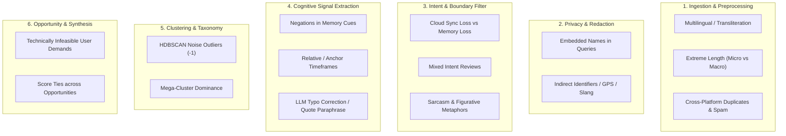
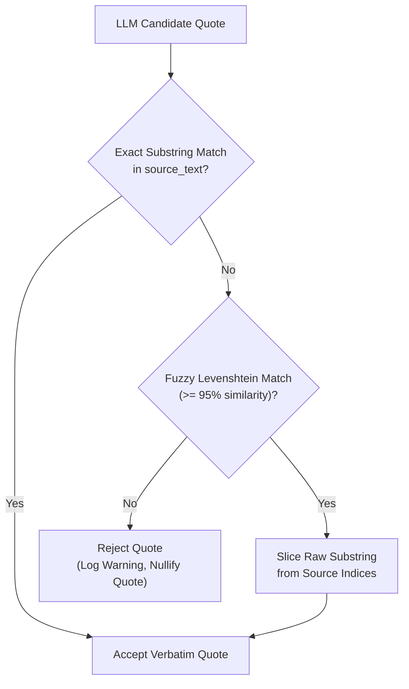

# Edge Case & Corner Scenario Handling Specification

---

## 1. Executive Summary & Purpose

The **Photo Retrieval Discovery Engine** operates on unstructured, messy public discussions across diverse platforms. Because the project enforces strict constraints—**zero PII leakage**, **verbatim quote authenticity (0% hallucination)**, and a **laser focus on partial-memory visual retrieval**—handling edge cases systematically is critical to prevent pipeline poisoning, metric distortion, or compliance violations.

This document identifies all known edge cases, defines detection criteria, and outlines programmatic fallback and resolution strategies across each pipeline stage.

---

## 2. Edge Case Classification Matrix



---

## 3. Stage-by-Stage Edge Cases & Resolution Strategies

---

### Stage 1: Ingestion & Privacy Sanitization

#### Edge Case 1.1: Embedded Names & People References in Search Queries
- **Scenario:** A user writes: *"I tried typing 'Uncle Bob's red canoe in Lake Tahoe' but got nothing."*
- **Risk:** Standard NER may miss "Uncle Bob" if uncapitalized or colloquial; lake/canoe isn't PII, but "Uncle Bob" is personally identifiable.
- **Resolution Strategy:**
  - Layered NER (Presidio + spaCy `PERSON` entity model) coupled with kinship lexicon matching (`Uncle`, `Aunt`, `Dad`, `Mom`, `Cousin` followed by proper nouns).
  - Anonymize to `[FAMILY_MEMBER]` or `[PERSON]`, preserving the cognitive structure of the query: *"I tried typing '[PERSON]'s red canoe in [LOCATION]' but got nothing."*

#### Edge Case 1.2: Multi-Language & Transliterated Feedback (e.g., Hinglish, Spanglish)
- **Scenario:** Reviews written in mixed languages or non-English scripts (e.g., *"Photo dhoondh nahi pa raha 2019 ki"* or *"No puedo encontrar la foto de mi perro"*).
- **Risk:** Filter models trained on English drop valid signal or extract corrupted terms.
- **Resolution Strategy:**
  - Run lightweight language detection (`fasttext` or `langdetect`).
  - Route non-English records through an initial lossless translation layer with provenance tagging (`language_detected: "es"`, `translated: true`), while preserving original text for verbatim quote alignment.

#### Edge Case 1.3: Extreme Review Lengths (Micro-Reviews vs. Multi-Paragraph Essays)
- **Scenario A (Micro):** Review is 3 words: *"can't find photos"*.
- **Scenario B (Macro):** Review is 1,200 words covering account creation, phone migration, 5 unrelated bug reports, and one paragraph about searching for an old receipt.
- **Resolution Strategy:**
  - *Micro-reviews:* Discard if character count $< 30$ or token count $< 6$. These lack sufficient cognitive cues for signal extraction.
  - *Macro-reviews:* Segment into semantic paragraphs using sliding window chunking ($250$ tokens with $50$ token overlap). Classify each chunk independently in Stage 2 to isolate the retrieval-specific passage.

#### Edge Case 1.4: Cross-Platform Duplicates & Bot Syndication
- **Scenario:** The same review or bot copy-paste appears 50 times across Play Store and forums.
- **Risk:** Artificial inflation of cluster frequency metrics.
- **Resolution Strategy:**
  - Compute MinHash / SimHash near-duplicate fingerprints on normalized text.
  - Deduplicate records with $> 85\%$ lexical similarity within a 14-day window; maintain a single canonical instance with `duplicate_count` preserved as an analytical weighting attribute.

---

### Stage 2: Intent & Relevancy Filtering

#### Edge Case 2.1: Data Loss / Cloud Sync Failure vs. Retrieval Memory Failure
- **Scenario:** *"I can't find my vacation photos from 2021 anywhere, the app completely lost them after the update!"*
- **Problem:** Superficial keywords ("can't find", "vacation photos 2021") suggest search failure, but the root cause is cloud deletion/backup sync loss.
- **Resolution Strategy:**
  - Create negative trigger patterns for permanent loss: `"deleted"`, `"missing after update"`, `"didn't backup"`, `"cloud wiped"`, `"vanished from account"`, `"empty library"`.
  - In Tier 2 LLM classifier, provide explicit boundary contrast examples differentiating *indexing/memory retrieval* from *data loss/backup corruption*.

#### Edge Case 2.2: Mixed Intent Reviews (Positive praise + feature frustration)
- **Scenario:** *"Google Photos is the best app ever, automatic backup is great, but honestly whenever I try to find a picture of my car insurance slip by typing 'insurance car' it gives me random car photos. Fix search!"*
- **Problem:** Sentiment analysis flags this as positive (4/5 stars); broad classifier might classify as generic praise.
- **Resolution Strategy:**
  - Do not filter based on star rating or global sentiment.
  - Evaluate presence of the retrieval struggle clause independently of overall sentiment.

#### Edge Case 2.3: Sarcasm & Metaphorical Expressions
- **Scenario:** *"Searching for a 2018 photo in this app is like asking a brick wall to recite Shakespeare."*
- **Problem:** Heuristic filters match "searching" but signal extractor fails because no concrete photo or cue is mentioned.
- **Resolution Strategy:**
  - Tier 2 Classifier evaluates whether the review provides *extractable memory signals* (photo type, cues, or search queries).
  - Purely rhetorical/sarcastic venting without descriptive retrieval context is tagged `IRRELEVANT_NOISE` and discarded.

---

### Stage 3: Cognitive Signal Extraction

#### Edge Case 3.1: Negated & Disconfirmed Memory Cues
- **Scenario:** *"I know for a fact it was NOT taken at the beach, and I was NOT wearing glasses, but search keeps showing beach pics."*
- **Risk:** Naive entity extractors extract "beach" and "glasses" as positive remembered cues.
- **Resolution Strategy:**
  - In the extraction prompt and schema, enforce explicit polarity:
    ```json
    {
      "remembered_cues": [],
      "explicitly_negated_cues": ["location: beach", "attribute: wearing glasses"]
    }
    ```
  - Treat negated cues as high-friction failure indicators of semantic drift.

#### Edge Case 3.2: Relative, Event-Anchored, and Epistemic Timeframes
- **Scenario:** *"Searching for the picture taken right after my graduation party, before we moved to Chicago, around when COVID started."*
- **Problem:** No standard Gregorian date (`YYYY-MM-DD`) exists.
- **Resolution Strategy:**
  - Schema defines temporal cues as `LIFEEVENT_ANCHOR` or `RELATIVE_TEMPORAL` rather than converting to calendar dates.
  - Preserves the exact cognitive representation: `"temporal_cue": {"type": "event_anchor", "detail": "right after graduation party / onset of COVID"}`.

#### Edge Case 3.3: LLM Normalization Breaking Verbatim Quote Matching
- **Scenario:**
  - Raw source: *"I searched for my dogg in the snoww and it faild."*
  - LLM outputs verbatim quote: *"I searched for my dog in the snow and it failed."* (auto-correcting typos).
- **Risk:** Programmatic assertion `assert quote in raw_source` fails.
- **Resolution Strategy:**
  1. *Fuzzy Alignment Fallback:* If exact substring match fails, compute character-level Levenshtein edit distance with a 95% threshold against sliding windows in the source.
  2. *Source Slice Recovery:* Locate the exact start/end character offsets in `source_text` corresponding to the match and slice the raw, uncorrected text.
  3. *Zero-Tolerance Hard Gate:* If alignment cannot locate the raw text slice, drop the quote attribute rather than allowing a paraphrased quote into the evidence bank.



#### Edge Case 3.4: Multi-Photo Struggles in a Single Conversation
- **Scenario:** A user describes two distinct failures in one post: *"I couldn't find my tax document screenshot from March, and also couldn't find the picture of my blue mountain bike."*
- **Resolution Strategy:**
  - Extractor returns `list[MemorySignalRecord]` for a single source ID, splitting compound narratives into atomic retrieval records while retaining source provenance.

---

### Stage 4: Semantic Clustering & Problem Taxonomy

#### Edge Case 4.1: HDBSCAN Outlier / Noise Accumulation (Label `-1`)
- **Scenario:** Up to 20-30% of records are labeled `-1` (unclustered noise) due to diverse phrasing.
- **Risk:** High-value edge case evidence is discarded, skewing frequency metrics.
- **Resolution Strategy:**
  - Calculate cosine similarity between each `-1` record embedding and existing cluster medoids.
  - If similarity $\ge 0.72$, soft-assign to the nearest cluster.
  - If similarity $< 0.72$, route to an "Emerging / Unclassified Signals" sandbox for secondary clustering with lower `min_cluster_size`.

#### Edge Case 4.2: Mega-Cluster Dominance Masking Granular Problems
- **Scenario:** 60% of records fall into a giant cluster titled *"General Screenshot Retrieval Failure"*.
- **Risk:** Obscures actionable nuances (e.g., OCR on dark mode text vs. cropped receipts vs. chat screenshots).
- **Resolution Strategy:**
  - Implement **Hierarchical Sub-Clustering**: Any cluster accounting for $> 35\%$ of total volume is automatically recursively re-clustered using UMAP/HDBSCAN on the sub-corpus.

#### Edge Case 4.3: Vocabulary Synonyms Causing Artificial Cluster Splitting
- **Scenario:** "Receipt", "invoice", "bill", "slip" create 4 small fragmented clusters.
- **Resolution Strategy:**
  - High-dimensional sentence embeddings (`all-mpnet-base-v2`) naturally group semantic synonyms.
  - An LLM-assisted cluster deduplication pass compares cluster centroids and merges clusters with cosine similarity $\ge 0.85$ and overlapping cognitive failure modes.

---

### Stage 5: Opportunity Scoring & Synthesis

#### Edge Case 5.1: High Desirability but Zero Technical Feasibility
- **Scenario:** Users demand: *"Google Photos should know which photo was taken when I felt happy"* or *"Find the picture of the girl I saw on the train"*.
- **Risk:** High frequency and frustration scores would rank this as a top opportunity.
- **Resolution Strategy:**
  - The opportunity scoring formula strictly gates ranking via the **Engineering & ML Feasibility ($M$)** coefficient:
    $$\text{Opportunity Score} = 0.40 \cdot I + 0.25 \cdot E + 0.20 \cdot M + 0.15 \cdot U$$
  - Hard Feasibility Gate: If $M \le 1.5$ (out of 5.0) due to technical impossibility, privacy violations, or ethical boundaries, the opportunity is disqualified from the top recommended slot and moved to a "Long-Term / Speculative Exploration" section.

#### Edge Case 5.2: Mathematical Score Ties
- **Scenario:** Two opportunity spaces (e.g., "Visual Color-Temporal Queries" and "Document OCR Screenshot Search") achieve identical overall opportunity scores ($4.22$).
- **Resolution Strategy:**
  - Deterministic tie-breaking hierarchy:
    1. Highest **Impact on Task Completion ($I$)**.
    2. Highest **Evidence Volume ($E$)** (number of verified verbatim quotes).
    3. Lowest implementation complexity / highest $M$.

---

### Stage 6: System Resilience & Execution Failures

| System Failure | Risk | Architectural Guardrail | Recovery Mechanism |
| :--- | :--- | :--- | :--- |
| **API Rate Limits (429s)** | Ingestion or LLM extraction aborts mid-run | Jittered exponential backoff with circuit breaker | Automatically pause worker threads, log rate limit event, and retry up to 5 times. |
| **LLM Token Ceiling Exceeded** | Ultra-long forum thread crashes parser | Pre-tokenization length check using `tiktoken` | Truncate middle sections of irrelevant chit-chat while keeping search narrative intact. |
| **Schema Validation Error** | LLM outputs non-conforming JSON | Pydantic strict schema validation with auto-retry | Send error trace back to LLM in a repair prompt; fallback to rule-based parser on 2nd failure. |
| **Storage Corruption / Interruption** | Pipeline crashes at stage 4; stages 1-3 lost | Intermediate Parquet checkpointing | Every stage writes atomic checkpoints to disk; `--resume-from-checkpoint` flag skips completed stages. |

---

## 4. End-to-End Edge Case Verification Suite

To guarantee system resilience, the following automated test cases must be added to the test suite:

```python
# tests/test_edge_cases.py
import pytest

def test_negated_cue_separation():
    """Verify that negated memory cues are not labeled as positive recall attributes."""
    pass

def test_verbatim_quote_typo_resilience():
    """Verify that minor LLM typo correction does not fail verbatim assertion."""
    pass

def test_pii_disguised_names_in_search():
    """Verify that informal names in search quotes (e.g., 'Aunt Sarah's dog') are redacted."""
    pass

def test_data_loss_vs_search_classification():
    """Verify that 'lost photos after update' is rejected while 'cannot search old photo' is accepted."""
    pass

def test_hdbscan_noise_soft_reassignment():
    """Verify that -1 outlier points are soft-assigned to nearest cluster if similarity threshold is met."""
    pass

def test_feasibility_gate_on_unrealistic_requests():
    """Verify that technically unfeasible requests cannot rank as top opportunity."""
    pass
```
