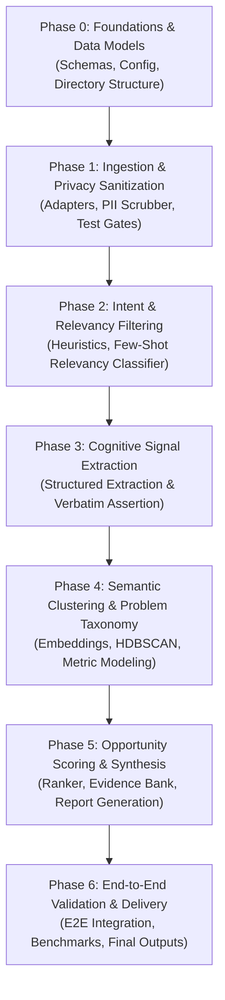

# Phase-Wise Implementation Plan: AI-Powered Photo Retrieval Discovery Engine

---

## 1. Executive Overview & Plan Principles

This document defines the actionable, phase-wise roadmap for building the **AI-Powered Photo Retrieval Discovery Engine** specified in [`architecture.md`](file:///C:/Users/Mukta%20Kulkarni/Downloads/GooglePhotosEngine/architecture.md) and bounded by [`problemStatement.md`](file:///C:/Users/Mukta%20Kulkarni/Downloads/GooglePhotosEngine/problemStatement.md).

### 1.1 Guiding Execution Principles
- **Strict Scope Guardrails:** Focus strictly on *imprecise visual memory retrieval* failures; reject generic performance or UI issues.
- **Evidence Veracity First:** 0% hallucination tolerance for user quotes; strictly enforced via automated substring verification.
- **Privacy & Compliance:** Pre-processing PII stripping is non-negotiable prior to any LLM ingestion.
- **Incremental Verification:** Every phase concludes with measurable quality gates, unit tests, and verified artifacts.

---

## 2. Phase Roadmap & Dependency Flow

---

## 3. Detailed Phase Breakdown

---

### Phase 0: Foundations, Infrastructure & Core Data Models
**Goal:** Establish project infrastructure, dependency management, shared configurations, and type-safe data contracts.

#### Tasks:
1. **Repository & Directory Initialization:**
   - Scaffold the module structure: `src/{common,ingestion,filtering,extraction,clustering,synthesis}`, `data/{raw,sanitized,filtered,extracted,output}`, and `tests/`.
   - Setup `pyproject.toml` with pinned dependencies (`pydantic>=2.5`, `duckdb>=0.9`, `sentence-transformers`, `scikit-learn`, `umap-learn`, `hdbscan`, `presidio-analyzer`, `presidio-anonymizer`, `rich`, `pytest`).
2. **Configuration & Logging Setup (`src/common/config.py`, `src/common/logger.py`):**
   - Centralize environment configurations (API keys, batch sizes, rate limits, directory paths).
   - Configure structured JSON logging with log rotation and redaction hooks.
3. **Pydantic Data Contracts (`src/common/schemas.py`):**
   - Implement `RawConversationRecord`, `SanitizedConversationRecord`, `FilteredConversationRecord`.
   - Define cognitive extraction schemas: `MemorySignalRecord`, `MemoryCueType`, `SearchFailureMode`.
   - Define clustering and synthesis schemas: `ProblemCluster`, `OpportunityRanking`.

#### Deliverables & Quality Gate:
- [x] All directories initialized with `.gitkeep` where appropriate.
- [x] Schema tests pass (`tests/test_schemas.py`) validating strict serialization/deserialization.
- [x] Zero circular dependencies across `src/common`.

---

### Phase 1: Multi-Source Ingestion & Privacy Sanitization
**Goal:** Ingest public conversations across diverse platforms while ensuring 100% PII removal.

#### Tasks:
1. **Abstract Ingestion Framework (`src/ingestion/base_adapter.py`):**
   - Create `BaseIngestionAdapter` with rate-limiting, retry backoff, and pagination.
2. **Platform Adapters:**
   - `play_store.py`: Ingest reviews for Google Photos / gallery apps via public APIs/scrapers.
   - `app_store.py`: Ingest Apple App Store user reviews.
   - `reddit_adapter.py`: Ingest public threads from r/googlephotos, r/Android, r/techsupport.
   - `community_forum.py`: Ingest public Google Support Community threads.
   - `youtube_adapter.py`: Ingest comments from public feature overview/tutorial videos.
3. **PII Sanitization Engine (`src/ingestion/pii_scrubber.py`):**
   - Build dual-layer redactor: Regex (emails, URLs, phones, IPs) + Microsoft Presidio / spaCy NER (names, locations, handles).
   - Substitute sensitive entities with deterministic tokens (`[USER]`, `[EMAIL]`, `[LOCATION]`).
4. **Data Lake Storage:**
   - Save immutable raw records into `data/raw/`.
   - Save scrubbed records into `data/sanitized/`.

#### Deliverables & Quality Gate:
- [x] Successful mock & live ingestion across at least 3 distinct public sources.
- [x] Automated test suite (`tests/test_pii_scrubber.py`) verifying 0% PII leakage on synthetic high-risk corpora (names, emails, phones).

---

### Phase 2: Intent & Relevancy Filtering Engine
**Goal:** Filter out general application complaints, backup errors, and UI feedback to isolate partial-recall retrieval conversations.

#### Tasks:
1. **Tier 1 Heuristic Pre-Filter (`src/filtering/heuristics.py`):**
   - Define lexical dictionary combining *retrieval verbs* ("find", "search", "locate", "scroll"), *media targets* ("photo", "screenshot", "receipt"), and *vague memory cues* ("remember", "forgot", "years ago").
   - Define negative exclusion patterns ("billing", "failed to backup", "battery drain", "subscription").
   - Filter corpus to high-recall candidate pool, dropping ~85-90% of irrelevant noise.
2. **Tier 2 Few-Shot Intent Classifier (`src/filtering/classifier.py`):**
   - Build few-shot LLM prompt classifying candidates into:
     - `RELEVANT_PARTIAL_MEMORY` (Proceed to Stage 3)
     - `GENERAL_SEARCH_USABILITY` (Discard: exact keyword or speed bugs)
     - `IRRELEVANT_NOISE` (Discard: general feedback)
   - Store filtered records in `data/filtered/retrieval_conversations.parquet`.

#### Deliverables & Quality Gate:
- [x] Precision benchmark on a labeled validation set of 100 diverse reviews: $\ge 90\%$ precision for `RELEVANT_PARTIAL_MEMORY`.
- [x] Unit test suite (`tests/test_filtering.py`) confirming boundary classification between partial-recall vs. general search.

---

### Phase 3: Cognitive Memory Signal Extraction
**Goal:** Parse unstructured user narratives into structured, machine-readable representations of human recall breakdowns.

#### Tasks:
1. **Few-Shot Extraction Prompts (`src/extraction/prompt_templates.py`):**
   - Construct schema-anchored prompt instructing the LLM to identify:
     - `photo_type`: Category of photo (screenshot, family portrait, receipt, scenery, document).
     - `remembered_cues`: List of cues the user recalled (color, setting, approximate timeframe, co-occurring objects).
     - `forgotten_details`: Attributes the user could not remember (exact date, filename, precise location).
     - `attempted_queries`: Search terms the user tried.
     - `failure_mode`: Root retrieval failure (`ZERO_RESULTS`, `SEMANTIC_DRIFT`, `CHRONOLOGICAL_OVERLOAD`, `OCR_FAILURE`, etc.).
     - `user_frustration_score`: Score from 1 to 5.
     - `verbatim_quote`: Exact excerpt from source text detailing the struggle.
2. **Structured Extractor Runner (`src/extraction/extractor.py`):**
   - Implement batch processing with asynchronous concurrency and exponential backoff.
   - Enforce schema validation via Pydantic; handle retries on schema violations.
3. **Deterministic Quote Verifier (`src/extraction/validator.py`):**
   - Assert `quote in raw_sanitized_text` for every extracted record.
   - Fall back to character slice extraction if LLM introduces subtle phrasing edits.
4. **Analytical Persistence:**
   - Store extracted signals in `data/extracted/signals.parquet` and register with DuckDB for rapid SQL querying.

#### Deliverables & Quality Gate:
- [x] 100% of persisted records pass `assert verbatim_quote in source_text`.
- [x] Zero malformed records in `data/extracted/signals.parquet`.
- [x] Automated test suite (`tests/test_quote_verifier.py`) passing.

---

### Phase 4: Semantic Clustering & Problem Taxonomy Engine
**Goal:** Aggregate individual memory breakdowns into macro problem archetypes and calculate quantitative severity and frequency metrics.

#### Tasks:
1. **Multi-Signal Vectorizer (`src/clustering/vectorizer.py`):**
   - Synthesize composite semantic strings per record:
     `"Photo: {photo_type} | Failed: {failure_mode} | Recalled: {remembered_cues} | Missing: {forgotten_details}"`
   - Generate dense vector representations using `sentence-transformers` (e.g., `all-MiniLM-L6-v2` or `all-mpnet-base-v2`).
2. **Density Clustering Pipeline (`src/clustering/clusterer.py`):**
   - Reduce dimensionality with UMAP (preserving local and global structure).
   - Apply HDBSCAN to discover natural clusters without pre-determining cluster count $k$.
   - Assign noise/unclustered points to nearest centroid based on cosine similarity thresholds.
3. **Problem Taxonomy & Metrics Aggregation (`src/clustering/taxonomy.py`):**
   - Compute quantitative metrics per cluster:
     - **Frequency ($F_C$):** Percentage of total retrieval discussions.
     - **Severity ($S_C$):** Mean user frustration score ($1.0 - 5.0$).
     - **Retrieval Impact Index ($RII_C$):** $F_C \times S_C$.
   - Automatically synthesize descriptive cluster titles and cognitive gap summaries via LLM inspection of cluster exemplars.
   - Generate 2x2 Retrieval Problem Map (Frequency vs. Severity matrix).

#### Deliverables & Quality Gate:
- [x] Clean cluster separation with silhouette score and exemplar coherence verified.
- [x] Export of `data/output/retrieval_problem_map.json` detailing all clusters and metrics.
- [x] Validation test ensuring metrics sum and scale correctly.

---

### Phase 5: Opportunity Scoring, Evidence Attribution & Deliverables
**Goal:** Translate problem clusters into prioritized opportunity spaces, attribute verbatim user quotes, and compile final artifacts.

#### Tasks:
1. **Multi-Factor Opportunity Ranker (`src/synthesis/ranking.py`):**
   - Implement scoring formula:
     $$\text{Score} = 0.40 \cdot \text{Impact} + 0.25 \cdot \text{Evidence Confidence} + 0.20 \cdot \text{ML Feasibility} + 0.15 \cdot \text{UX Addressability}$$
   - Rank all candidate opportunities and determine the primary recommended opportunity.
2. **Verbatim Evidence Bank Builder (`src/synthesis/quote_bank.py`):**
   - Index validated quotes grouped by problem archetype and photo type.
   - Include metadata (platform source, anonymized date, failure mode) alongside each verbatim quote.
3. **Deliverable Compiler (`src/synthesis/report_generator.py`):**
   - Generate `data/output/retrieval_problem_map.json`: Complete data taxonomy.
   - Generate `data/output/verbatim_evidence_bank.md`: Categorized evidence bank for UX and PM stakeholders.
   - Generate `data/output/opportunity_analysis.md`: Executive opportunity report with comparative trade-off tables and the single primary recommended opportunity.

#### Deliverables & Quality Gate:
- [x] All 3 core project deliverables created and validated against constraints.
- [x] Quotes are 100% verbatim and contain zero PII.
- [x] Single clear recommendation highlighted with justification across engineering, UX, and product impact.

---

### Phase 6: End-to-End Orchestration, QA & Delivery
**Goal:** Provide unified CLI runner, full-suite automated regression testing, and final project documentation.

#### Tasks:
1. **CLI Pipeline Runner (`scripts/run_pipeline.py`):**
   - Build unified CLI with options:
     `python scripts/run_pipeline.py --source all --sample-size 500 --export-reports`
   - Implement resume capability: pipeline checkpoints state at each stage.
2. **Automated End-to-End QA Test (`tests/test_e2e_pipeline.py`):**
   - Run end-to-end integration test on synthetic test dataset to verify pipeline execution from ingestion through to markdown report generation.
3. **Final Delivery & Verification:**
   - Verify all stakeholder questions in `problemStatement.md` are answered.
   - Final review of privacy, verbatim veracity, and scope constraints.

#### Deliverables & Quality Gate:
- [x] Single command runs end-to-end pipeline cleanly.
- [x] Full test suite passes (`pytest tests/`).

---

## 4. Phase Schedule & Milestones Summary

| Phase | Core Deliverable | Primary Risk | Mitigation |
| :--- | :--- | :--- | :--- |
| **Phase 0** | Schema definitions & project scaffolding | Schema churn | Align Pydantic models directly with analytical requirements |
| **Phase 1** | Ingestion adapters & PII scrubber | Source rate-limits / PII leakage | Backoff exponential retries; dual-pass NER + regex masking |
| **Phase 2** | Two-tier relevancy classifier | High noise in raw reviews | Aggressive negative keyword filter before LLM classifier |
| **Phase 3** | Cognitive signal extractor & quote verifier | LLM hallucinating/paraphrasing quotes | Hard programmatic substring assertion against original source |
| **Phase 4** | HDBSCAN clustering & Problem Map | Sparse or noisy clusters | UMAP parameter tuning; merge low-density outliers into sandbox |
| **Phase 5** | Opportunity analysis & Evidence bank | Subjective opportunity ranking | Weighted quantitative scoring model combining impact & feasibility |
| **Phase 6** | E2E CLI pipeline runner & test suite | Pipeline breaking across stages | State checkpointing with Parquet/DuckDB between stages |

---

## 5. Definition of Done (DoD) Checklist

- [x] **Data Integrity:** All ingested and analyzed data is strictly from public sources with zero ToS violations.
- [x] **Privacy:** Zero PII exists in any saved parquet, JSON, or markdown deliverable.
- [x] **Verbatim Quotes:** Every quote in the evidence bank is an exact substring match of the ingested source text.
- [x] **Deliverables Complete:**
  - [x] `retrieval_problem_map.json` generated with frequency and severity metrics.
  - [x] `verbatim_evidence_bank.md` generated with categorized quotes.
  - [x] `opportunity_analysis.md` generated with ranked opportunities and a primary recommendation.
- [x] **Test Coverage:** All unit tests for PII scrubbing, filtering, quote verification, and schemas pass.
